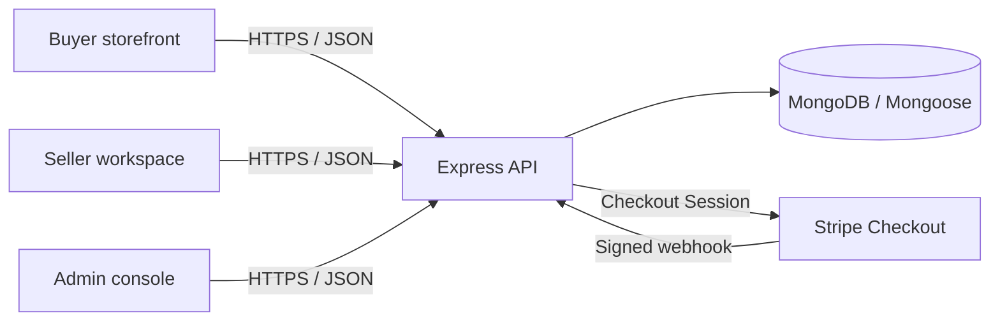
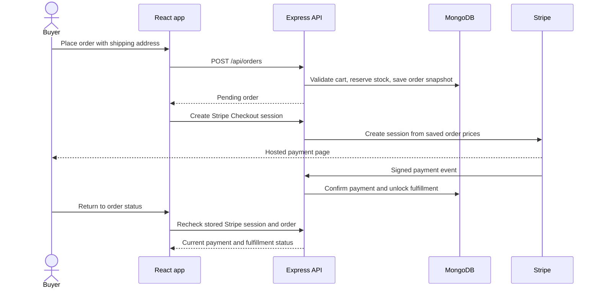

# Marketplace

> A full-stack multi-vendor commerce platform where shoppers discover products, independent sellers manage their catalog and fulfillment, and administrators oversee the marketplace.


Marketplace is a portfolio project built around the parts of commerce that need careful coordination: role-aware access, inventory, order snapshots, seller fulfillment, and asynchronous payment confirmation. It includes a responsive React storefront and dashboards backed by an Express API and MongoDB.

## At a glance

| | |
|---|---|
| **Buyers** | Browse and filter products, manage a cart, check out with Stripe, track orders, and review delivered purchases. |
| **Sellers** | Create and maintain listings, monitor inventory, and advance fulfillment for their own order items. |
| **Administrators** | Review marketplace activity, manage accounts and categories, moderate listings, and inspect orders. |
| **Payments** | Stripe-hosted Checkout with signed webhooks, duplicate-event handling, and a server-side payment status confirmation path. |

## Product experience

- **Product discovery:** Search, category and brand filters, price and rating ranges, stock filtering, sorting, pagination, and related products.
- **Cart and checkout:** Server-calculated prices, stock validation, shipping address capture, and order creation with inventory reservation.
- **Order lifecycle:** Buyer order history and status timeline; seller-level item fulfillment from confirmation through delivery.
- **Verified reviews:** Reviews are limited to buyers whose order item has been delivered. Buyers can manage their own review.
- **Role-specific workspaces:** Buyer, seller, and administrator routes are protected in the app, with access rules enforced again by the API.
- **Responsive interface:** Storefront, authentication, and operational dashboards adapt to narrow screens, with keyboard focus and reduced-motion support.

## Architecture



The frontend is a React single-page application built with Vite and React Router. The backend exposes REST endpoints, validates requests, applies authentication and role checks, and owns pricing and inventory decisions. In development, Vite proxies `/api` requests to Express.

### A purchase, end to end



Order checkout and cancellation use MongoDB transactions so stock and cart changes are committed together. This requires MongoDB transaction support (MongoDB Atlas or a replica set).

## Technology

| Area | Tools |
|---|---|
| Frontend | React 19, React Router, Vite, Tailwind CSS 4, Axios |
| Backend | Node.js, Express 4, Mongoose |
| Authentication | bcryptjs password hashing, JWT in an httpOnly cookie, role and ownership middleware |
| Payments | Stripe Checkout Sessions and signed webhooks |
| Security | Helmet, exact-origin credentialed CORS, origin checks for cookie writes, request limits, Mongo operator sanitization, HTTP parameter-pollution protection, and rate limits |
| Tests | Jest and Supertest |

## Run locally

### Requirements

- Node.js 18 or newer
- MongoDB with transaction support for checkout and order cancellation
- Stripe test-mode keys to exercise payment flows (optional for browsing and most development)

### 1. Install dependencies

From the project root:

```powershell
npm run install:all
```

### 2. Configure the backend

```powershell
Copy-Item backend/.env.example backend/.env
```

Edit `backend/.env` and set at least:

```dotenv
MONGO_URI=mongodb://127.0.0.1:27017/marketplace
JWT_SECRET=replace-with-a-random-secret-at-least-32-characters
CLIENT_URL=http://localhost:5173
```

To test Stripe checkout, set your **test-mode** credentials in this private file:

```dotenv
STRIPE_SECRET_KEY=sk_test_your_key
STRIPE_WEBHOOK_SECRET=whsec_your_webhook_secret
```

Never put the Stripe secret key in frontend environment variables or commit real secrets. The values in `.env.example` are placeholders.

### 3. Start the app

```powershell
npm run dev
```

- Frontend: [http://localhost:5173](http://localhost:5173)
- API health: [http://localhost:5000/api/health](http://localhost:5000/api/health)

The backend connects to MongoDB before it starts listening. Check the terminal output if startup stops at the database connection.

### Optional: configure a local Stripe webhook

Install and authenticate the Stripe CLI, then run:

```powershell
stripe listen --events checkout.session.completed,checkout.session.async_payment_succeeded,checkout.session.async_payment_failed,checkout.session.expired,charge.refunded --forward-to http://localhost:5000/api/payments/stripe/webhook
```

Copy the `whsec_...` value printed by the CLI into `STRIPE_WEBHOOK_SECRET` in `backend/.env`, then restart the backend. Use Stripe test mode and test card details from Stripe’s official testing guide; no real card is needed.

### Optional: create an administrator

Set `BOOTSTRAP_ADMIN_EMAIL` and `BOOTSTRAP_ADMIN_PASSWORD` in `backend/.env`, then run:

```powershell
npm run bootstrap:admin --prefix backend
```

The script creates or promotes that account in the configured database.

## Verification

Run from the project root:

```powershell
npm run build             # production frontend build
npm run test:unit         # pure utility tests
npm run test:integration  # HTTP, validation, and security tests
npm run test:system       # authentication journey through Express
npm test                  # full backend suite
```

The system authentication tests use a mocked user repository, so tests do not access your local MongoDB or Stripe account. The test suite currently focuses on backend utilities, API protections, and the authentication journey; it does not yet automate browser flows or run full purchase tests against a dedicated database.

## Project layout

```text
marketplace/
├── backend/
│   ├── src/controllers/    # API behavior and business rules
│   ├── src/middleware/     # Authentication, validation support, and security
│   ├── src/models/         # Mongoose schemas
│   ├── src/routes/         # REST route definitions
│   ├── src/services/       # Stripe integration
│   └── tests/              # Unit, integration, and system tests
└── frontend/
    └── src/
        ├── components/     # Shared storefront components
        ├── context/        # Authentication state
        ├── pages/          # Buyer, seller, admin, and auth screens
        └── routes/         # Protected route handling
```

## Engineering details

- **Server-owned totals:** Checkout line items are derived from the saved order snapshot; the browser never sets the amount charged.
- **Order history integrity:** Orders embed item, price, and seller snapshots so later listing edits do not rewrite a past purchase.
- **Seller data boundaries:** Seller product and fulfillment operations are scoped to the signed-in seller’s resources.
- **Payment resilience:** Webhook signatures are verified against the raw request body; event processing is idempotent. The buyer return flow can retrieve the Checkout Session from Stripe if a webhook was delayed or missed.
- **Inventory safety:** Stock reservation and restoration happen transactionally during order creation and unpaid-order cancellation.
- **Review eligibility:** A review requires a delivered item from the buyer’s own order, with one review per buyer/product.

## Current scope

This project demonstrates a working marketplace workflow in development and Stripe test mode. It is not presented as a production-hardened commercial platform. The following are outside the current scope:

- Image upload and managed media storage (listings currently accept image URLs)
- Stripe Connect seller onboarding, split payments, and payouts
- Tax and shipping-rate calculation
- Refund initiation from the application (refund state can be updated from Stripe refund events)
- Automated browser tests and full purchase-flow tests against a dedicated MongoDB replica set

## Next steps

1. Add automated browser coverage for buyer, seller, and admin workflows.
2. Add dedicated integration infrastructure using a disposable MongoDB replica set.
3. Add managed image uploads and seller payout onboarding with Stripe Connect.
4. Add CI checks for tests, linting, and production builds.
